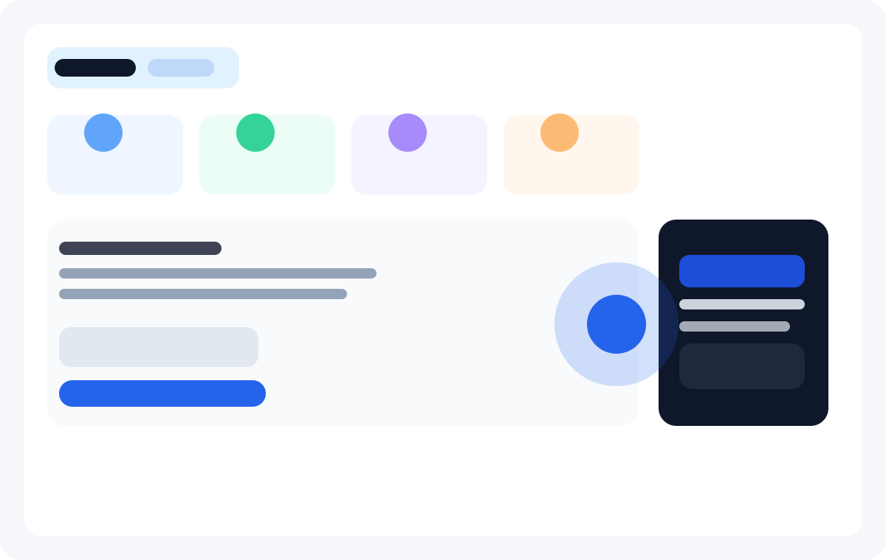

# FlyRank AI Coach

FlyRank is a production-minded Next.js app for students, interns, and early-career professionals who want a calmer, more structured path through applications, portfolio work, and interview prep. The product pairs a polished dashboard with an AI coach that turns vague goals into step-by-step actions.

## What it does

- Generates a practical weekly plan from a short user prompt.
- Helps job seekers turn coursework and projects into a clearer story for recruiters.
- Creates a simple, visible workflow for portfolio and README improvements.
- Keeps the AI route safe by limiting request volume and restricting oversized inputs.

## Screenshots



## Production URL

This environment does not include a Vercel login or deployment token, so I could not publish a live public URL from the current machine. The app is prepared for Vercel deployment and the final live URL should be the standard Vercel project URL after the repository is connected and deployed.

Example format:

```text
https://flyrank-ai-coach.vercel.app
```

## Local run

### Prerequisites

- Node.js 20+
- npm 10+

### Install and start

```bash
git clone <your-repo-url>
cd assignment-last
npm install
cp .env.example .env.local
npm run dev
```

Then open:

```text
http://localhost:3000
```

## Environment variables

Create a local `.env.local` from `.env.example` before running the app.

| Name | Required | Purpose |
| --- | --- | --- |
| `NEXT_PUBLIC_APP_NAME` | No | Display name used in UI and metadata. |
| `NEXT_PUBLIC_APP_URL` | Yes for production | Canonical public URL used by metadata and Vercel. |
| `OPENAI_API_KEY` | No for demo mode | Enables live OpenAI completions for the AI chat route. |
| `RATE_LIMIT_PER_MINUTE` | No | Optional override for abuse protection settings. |
| `MAX_INPUT_CHARS` | No | Caps message size before the server rejects the request. |

Example:

```bash
NEXT_PUBLIC_APP_NAME="FlyRank AI Coach"
NEXT_PUBLIC_APP_URL="https://flyrank-ai-coach.vercel.app"
OPENAI_API_KEY="sk-..."
RATE_LIMIT_PER_MINUTE="5"
MAX_INPUT_CHARS="800"
```

## Architecture overview

```text
Browser
  -> Next.js App Router page
  -> /api/chat route
  -> rate-limit guard + input validation
  -> OpenAI API (optional)
  -> streaming text response back to UI
```

Key files:

- `app/page.tsx` — dashboard and chat UI
- `app/api/chat/route.ts` — rate limiting, validation, and streaming response
- `app/globals.css` — responsive styling and visual polish
- `vercel.json` — Vercel deployment metadata
- `.env.example` — environment setup

## Production hygiene and decisions

### AI route protection

The AI route includes:

- an IP-based rolling rate limit of 5 requests per minute per client,
- a strict input cap of 800 characters,
- JSON validation for malformed requests,
- a safe fallback response when the API key is absent.

This is intentionally lightweight and easy to reason about for a project demo. It blocks trivial abuse without introducing Redis or a full auth system on day one.

### Streaming timeout

The route exports a server-side streaming timeout:

```ts
export const maxDuration = 30;
```

That keeps long-running AI requests from hanging forever in Vercel and gives the app a predictable ceiling for latency and spend.

### Browser compatibility

The interface is built with responsive layouts and native form controls so it behaves cleanly in Chrome, Firefox, Safari, and mobile Safari without relying on unsupported UI patterns.

## Vercel deployment steps

1. Push this repository to GitHub.
2. Import the repo in Vercel.
3. Set environment variables in the Vercel dashboard.
4. Optionally add a custom domain.
5. Deploy production and verify the app at the generated Vercel URL.

## How AI tools built this

This project was built with AI assistance in a realistic workflow rather than as a fully autonomous push. The workflow looked like this:

- AI was used to scaffold the Next.js app and quickly generate the UI shell.
- AI helped draft the API route, rate-limiting guardrails, and validation logic.
- AI assisted with documentation and production hygiene details.
- A human reviewed the final behavior, tightened the safety checks, and made the decision to keep the app resilient when `OPENAI_API_KEY` is missing.

The important part is that the final product was reviewed and adjusted by a human before shipping. That is the honest, production-friendly version of AI-assisted development: speed plus verification.

## Git history note

This project was created as a clean application scaffold rather than rewritten from a messy branch history. No forced history rewrite was necessary for the current deliverable.

## License

MIT
